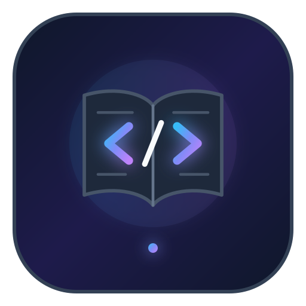

  

  

    
    
    
  

  

    <i>Grande Encyclopédie Universelle des Langages de Programmation (710 fiches documentaires standardisées).</i> 
    Dépôt <a href="https://github.com/DevRedious/docs-languages">DevRedious/docs-languages</a>
  

---

## Structure du projet

Chaque documentation de langage respecte un format strict et concis, découpé en trois sections :

1. **Histoire** : 5 repères chronologiques clés (création, évolutions, standardisation, maturité, état actuel).
2. **Utilité** : 5 points synthétiques sur la nature, le rôle, les forces techniques, les cas d'usage et l'écosystème.
3. **Ressources** : Lien officiel de référence.

## Bibliothèque des langages (710 fiches)

Cliquez sur le logo d'un langage pour ouvrir directement sa fiche documentaire :

### Langages Systèmes & Bas Niveau (80)

                        [-1E293B?style=for-the-badge&logo=c&logoColor=white)](languages/ficl.md)    [-1E293B?style=for-the-badge&logo=c&logoColor=white)](languages/hla.md)       [-1E293B?style=for-the-badge&logo=c&logoColor=white)](languages/masm.md)   [-1E293B?style=for-the-badge&logo=c&logoColor=white)](languages/nasm.md)                    [-A8B9CC?style=for-the-badge&logo=c&logoColor=black)](languages/ansi-c.md)          [-6E4C13?style=for-the-badge&logo=assemblyscript&logoColor=white)](languages/bal-assembly.md) [-A8B9CC?style=for-the-badge&logo=c&logoColor=black)](languages/c-11.md) [-A8B9CC?style=for-the-badge&logo=c&logoColor=black)](languages/c-23.md) [-A8B9CC?style=for-the-badge&logo=c&logoColor=black)](languages/c-99.md) [-A8B9CC?style=for-the-badge&logo=c&logoColor=black)](languages/c-plus-plus-11.md)       

### Langages Applicatifs & Entreprise (26)

                     [-1E3A8A?style=for-the-badge&logo=openjdk&logoColor=white)](languages/a-sharp.md)    

### Entreprise, ERP & 4GL Métier (42)

 [-052FAD?style=for-the-badge&logo=ibm&logoColor=white)](languages/rpg.md) [-002D62?style=for-the-badge&logo=medicare&logoColor=white)](languages/mumps.md) [-5BC500?style=for-the-badge&logo=progress&logoColor=white)](languages/progress-abl.md)        [-0F766E?style=for-the-badge&logo=ibm&logoColor=white)](languages/bbx.md)           [-004B87?style=for-the-badge&logo=j&logoColor=white)](languages/jcl.md)        [-276DC3?style=for-the-badge&logo=r&logoColor=white)](languages/powerbuilder.md)    [-276DC3?style=for-the-badge&logo=r&logoColor=white)](languages/sqr.md) [-CC292B?style=for-the-badge&logo=microsoftsqlserver&logoColor=white)](languages/t-sql.md)    [-0F766E?style=for-the-badge&logo=ibm&logoColor=white)](languages/x-sharp.md)  

### Langages Web & Scripting Dynamique (37)

             [-FF0000?style=for-the-badge&logo=adobe&logoColor=white)](languages/cfml.md)    [-7F5AB6?style=for-the-badge&logo=gnuemacs&logoColor=white)](languages/emacs-lisp.md)   [-B45309?style=for-the-badge&logo=javascript&logoColor=white)](languages/flow-js.md)       [-276DC3?style=for-the-badge&logo=r&logoColor=white)](languages/raku.md)         

### GPU, Shaders & Graphisme (9)

     [-000000?style=for-the-badge&logo=apple&logoColor=white)](languages/metal.md) [-A8B9CC?style=for-the-badge&logo=c&logoColor=black)](languages/cg.md)  

### Jeux Vidéo & Moteurs 3D (31)

[-478CBF?style=for-the-badge&logo=godotengine&logoColor=white)](languages/gdscript.md)  [-000000?style=for-the-badge&logo=gamemaker&logoColor=white)](languages/gml.md)              [-7E22CE?style=for-the-badge&logo=unrealengine&logoColor=white)](languages/lsl.md) [-7E22CE?style=for-the-badge&logo=unrealengine&logoColor=white)](languages/mel.md)             

### Audio, Musique & DSP Temps Réel (5)

  [-00457C?style=for-the-badge&logo=soundcharts&logoColor=white)](languages/pure-data.md)  

### Requêtes de Données, Graphes & Schémas (15)

[-E10098?style=for-the-badge&logo=graphql&logoColor=white)](languages/graphql.md)  [-008CC1?style=for-the-badge&logo=neo4j&logoColor=white)](languages/cypher.md)   [-0089D6?style=for-the-badge&logo=microsoftazure&logoColor=white)](languages/kql.md)         

### Shells & Outils de Flux Unix (19)

 [-F1502F?style=for-the-badge&logo=zsh&logoColor=white)](languages/zsh.md)  [-003366?style=for-the-badge&logo=kx&logoColor=white)](languages/ksh.md) [-18181B?style=for-the-badge&logo=gnubash&logoColor=white)](languages/tcsh.md)    [-003366?style=for-the-badge&logo=kx&logoColor=white)](languages/awk-gawk.md)   [-18181B?style=for-the-badge&logo=gnubash&logoColor=white)](languages/batch.md) [-A8B9CC?style=for-the-badge&logo=c&logoColor=black)](languages/csh.md) [-B03931?style=for-the-badge&logo=d&logoColor=white)](languages/dcl.md) [-38BDF8?style=for-the-badge&logo=fishshell&logoColor=white)](languages/fish-shell-4.md)    

### Spécification Formelle & Modélisation (26)

[-FF9900?style=for-the-badge&logo=amazonwebservices&logoColor=white)](languages/tla-plus.md)   [-0B3D91?style=for-the-badge&logo=nasa&logoColor=white)](languages/promela.md)   [-4338CA?style=for-the-badge&logo=mathworks&logoColor=white)](languages/adl.md)   [-003366?style=for-the-badge&logo=sncf&logoColor=white)](languages/b-method.md)    [-A8B9CC?style=for-the-badge&logo=c&logoColor=black)](languages/cel.md)     [-003366?style=for-the-badge&logo=eth&logoColor=white)](languages/event-b.md)       

### Langages Fonctionnels & Déclaratifs (51)

  [-4B32C3?style=for-the-badge&logo=edx&logoColor=white)](languages/standard-ml.md)                         [-6D28D9?style=for-the-badge&logo=haskell&logoColor=white)](languages/arc-anarki.md)                 [-A8B9CC?style=for-the-badge&logo=c&logoColor=black)](languages/haskell-ghc.md)      

### Scientifiques, Mathématiques & Finance (67)

         [-003366?style=for-the-badge&logo=kx&logoColor=white)](languages/k.md) [-00558F?style=for-the-badge&logo=kx&logoColor=white)](languages/q.md)  [-FFD100?style=for-the-badge&logo=nationalinstruments&logoColor=black)](languages/labview.md)          [-1D4ED8?style=for-the-badge&logo=julia&logoColor=white)](languages/arena.md)   [-A8B9CC?style=for-the-badge&logo=c&logoColor=black)](languages/bc.md)     [-A8B9CC?style=for-the-badge&logo=c&logoColor=black)](languages/c-star.md)              [-1D4ED8?style=for-the-badge&logo=julia&logoColor=white)](languages/maxima.md)         [-00558F?style=for-the-badge&logo=kx&logoColor=white)](languages/q-sharp.md)             

### Logiques & Preuves (Formels) (28)

    [-C73B28?style=for-the-badge&logo=inria&logoColor=white)](languages/coq.md)              [-C73B28?style=for-the-badge&logo=inria&logoColor=white)](languages/coq-rocq.md)  [-A8B9CC?style=for-the-badge&logo=c&logoColor=black)](languages/curry-kics2.md)       

### Smart Contracts & Web3 (14)

      [-00EF8B?style=for-the-badge&logo=flow&logoColor=black)](languages/cadence.md) [-0033AD?style=for-the-badge&logo=cardano&logoColor=white)](languages/plutus.md) [-2C7DF7?style=for-the-badge&logo=tezos&logoColor=white)](languages/michelson.md) [-29CCC4?style=for-the-badge&logo=zilliqa&logoColor=black)](languages/scilla.md)    

### Description Matérielle & Open Hardware (25)

   [-DC322F?style=for-the-badge&logo=scala&logoColor=white)](languages/chisel.md) [-003366?style=for-the-badge&logo=mit&logoColor=white)](languages/bluespec.md)  [-0E7490?style=for-the-badge&logo=ieee&logoColor=white)](languages/aml.md) [-0E7490?style=for-the-badge&logo=ieee&logoColor=white)](languages/apt.md)       [-0E7490?style=for-the-badge&logo=ieee&logoColor=white)](languages/g-code.md)  [-A8B9CC?style=for-the-badge&logo=c&logoColor=black)](languages/ladder-logic.md)      [-276DC3?style=for-the-badge&logo=r&logoColor=white)](languages/spin-propeller.md)  

### Systèmes Modulaires & Wirth (5)

    

### Langages Hybrides & Spécifiques (40)

                                   [-1B365D?style=for-the-badge&logo=mozart&logoColor=white)](languages/oz.md)  [-374151?style=for-the-badge&logo=codeigniter&logoColor=white)](languages/pwct.md)  

### Langages Historiques & Pionniers (100)

                                         [-A8B9CC?style=for-the-badge&logo=c&logoColor=black)](languages/bywater-basic.md)      [-A8B9CC?style=for-the-badge&logo=c&logoColor=black)](languages/clx.md)   [-A8B9CC?style=for-the-badge&logo=c&logoColor=black)](languages/cool.md)                      [-003366?style=for-the-badge&logo=kx&logoColor=white)](languages/kcl.md) [-00ADD8?style=for-the-badge&logo=go&logoColor=white)](languages/lingo.md)  [-B03931?style=for-the-badge&logo=d&logoColor=white)](languages/mad.md)         [-A8B9CC?style=for-the-badge&logo=c&logoColor=black)](languages/quickbasic.md)      [-334155?style=for-the-badge&logo=computerhistory&logoColor=white)](languages/slip.md)     [-00ADD8?style=for-the-badge&logo=go&logoColor=white)](languages/ucb-logo.md)    

### Automatisation Desktop & Web Scripting (15)

     [-0081FB?style=for-the-badge&logo=meta&logoColor=white)](languages/hack.md) [-0369A1?style=for-the-badge&logo=windows&logoColor=white)](languages/appscript.md)     [-0369A1?style=for-the-badge&logo=windows&logoColor=white)](languages/nsis.md) [-217346?style=for-the-badge&logo=microsoftexcel&logoColor=white)](languages/vba.md)  

### Ésotériques & Théorie Informatique (12)

      [-A8B9CC?style=for-the-badge&logo=c&logoColor=black)](languages/chef.md)  [-A8B9CC?style=for-the-badge&logo=c&logoColor=black)](languages/core-war.md)   [-4C1D95?style=for-the-badge&logo=ghost&logoColor=white)](languages/shakespeare.md)

### Langages Émergents & Recherche (7)

      

### Frameworks, Runtimes & Écosystèmes (40)

                                     [-41CD52?style=for-the-badge&logo=qt&logoColor=white)](languages/qml.md) [-F05138?style=for-the-badge&logo=swift&logoColor=white)](languages/swift-server.md) 

### Fiches Complémentaires (20)

     [-A8B9CC?style=for-the-badge&logo=c&logoColor=black)](languages/c-al.md)     [-B03931?style=for-the-badge&logo=d&logoColor=white)](languages/datalog- souffle.md) [-EE1F35?style=for-the-badge&logo=delphi&logoColor=white)](languages/delphi.md)    [-1F2937?style=for-the-badge&logo=codeigniter&logoColor=white)](languages/esp.md)    

## Modèle

Pour ajouter ou proposer une nouvelle fiche, suivez le format défini dans [TEMPLATE.md](TEMPLATE.md).
